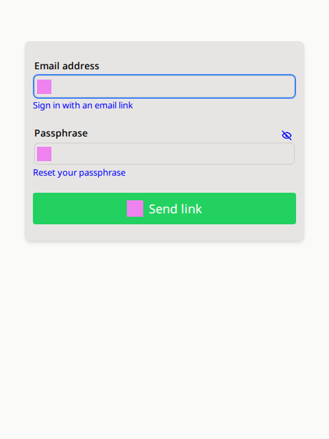
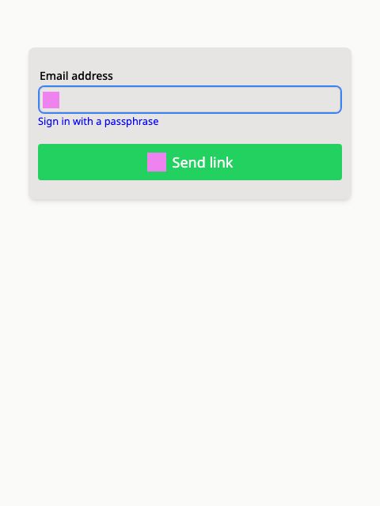

# Supabase Auth UI for Svelte

THIS README FILE WAS AI GENERATED BY CLAUDE 4 SONNET

A comprehensive, customizable authentication UI component library for Svelte applications using Supabase.
Built with Svelte 5 and TypeScript, this library provides a complete authentication flow with support for
email/password, OAuth providers, multi-factor authentication (MFA), and more.

## Features

### 🔐 Complete Authentication Flow
- **Email/Password Authentication**: Sign up, sign in, and password reset
- **Magic Link Authentication**: Passwordless login via email links
- **Social OAuth Providers**: Support for Google, GitHub, and other OAuth providers
- **Multi-Factor Authentication (MFA)**: TOTP-based 2FA with QR codes
- **Account Management**: Profile updates, email changes, account deletion

### 🎨 Highly Customizable
- **Flexible Styling**: CSS custom properties and customizable components
- **Layout Options**: Vertical/horizontal social button layouts
- **Size Variants**: Multiple button sizes (tiny, small, medium, large)
- **Custom Components**: Replace built-in components with your own

### 🌍 Internationalization (i18n)
- **Built-in Languages**: English (default), Arabic, Spanish, French, Chinese
- **Custom Translations**: Add your own language translations
- **External i18n Support**: Integrate with existing i18n libraries
- **RTL Support**: Right-to-left language support

### ⚙️ Configurable Options
- **Supabase Config Integration**: Reads from `supabase/config.toml`
- **Password Policies**: Configurable length, complexity, breach checking
- **Email Settings**: OTP length, expiry, confirmation requirements
- **Security Features**: Double email confirmation, secure password changes

### 🛡️ Security Best Practices
- **NIST Guidelines**: Follows NIST 800-63b-4 authentication guidelines as much as possible
- **Password Strength**: Built-in password strength indicators
- **Breach Detection**: Integration with HaveIBeenPwned API

### 🧪 Behavioral Testing Flows
- **Email signup**: Create account with password, email code, or email link
- **Email sign in**: Sign in with password, email code, or email link
- **Multi-factor authentication**: Create, update, delete TOTP MFA factors
- **Password changes**: Change the password for the account
- **Password strength tests**: Disallow breached, repetitive, or context-specific passwords

## Installation

```bash
npm install supabase-ui-svelte
# or
pnpm add supabase-ui-svelte
# or
yarn add supabase-ui-svelte
```

### Peer Dependencies

```bash
npm install @supabase/supabase-js svelte
```

## Quick Start

```svelte
<script>
  import { Auth } from 'supabase-ui-svelte'
  import { createClient } from '@supabase/supabase-js'

  const supabaseClient = createClient(
    'your-supabase-url',
    'your-supabase-anon-key'
  )
</script>

<Auth {supabaseClient} />
```

## Advanced Usage

### With OAuth Providers

```svelte
<script>
  import { Auth } from 'supabase-ui-svelte'
  import { createClient } from '@supabase/supabase-js'

  const supabaseClient = createClient(
    'your-supabase-url',
    'your-supabase-anon-key'
  )

  const providers = ['google', 'github', 'facebook']
</script>

<Auth
  {supabaseClient}
  {providers}
  socialLayout="horizontal"
  socialButtonSize="medium"
/>
```

### Custom Configuration

```svelte
<script>
  import { Auth } from 'supabase-ui-svelte'

  const authOptions = {
    auth: {
      enable_signup: true,
      enable_anonymous_sign_ins: false,
      email: {
        enable_signup: true,
        enable_confirmations: true,
        otp_length: 6,
        otp_expiry: 3600
      },
      mfa: {
        required: false,
        totp: {
          enroll_enabled: true,
          verify_enabled: true
        }
      }
    },
    passwordPolicy: {
      minLength: 12,
      goodLength: 15,
      requiredCharacters: ""
    }
  }
</script>

<Auth {supabaseClient} {authOptions} />
```

### Internationalization

```svelte
<script>
  import { Auth } from 'supabase-ui-svelte'
  // Import additional languages
  import 'supabase-ui-svelte/i18n/languages/es'
  import 'supabase-ui-svelte/i18n/languages/fr'

  // Custom text overrides
  const customTexts = {
    signIn: 'Login',
    signUp: 'Create Account',
    emailLabel: 'Your Email'
  }
</script>

<Auth
  {supabaseClient}
  locale="es"
  texts={customTexts}
/>
```

### Custom Authenticated View

```svelte
<script>
  import { Auth } from 'supabase-ui-svelte'
</script>

<Auth {supabaseClient}>
  {#snippet signedInAs(user)}
    <div class="welcome-banner">
      <h2>Welcome back, {user?.email}!</h2>
      <p>Account created: {new Date(user?.created_at).toLocaleDateString()}</p>
    </div>
  {/snippet}

  {#snippet userInfo(user)}
    <div class="user-details">
      <p>Last sign in: {new Date(user?.last_sign_in_at).toLocaleDateString()}</p>
      <p>Email verified: {user?.email_confirmed_at ? 'Yes' : 'No'}</p>
    </div>
  {/snippet}
</Auth>
```

## Component Props

### Auth Component

| Prop | Type | Default | Description |
|------|------|---------|-------------|
| `supabaseClient` | `SupabaseClient` | **Required** | Supabase client instance |
| `class` | `string` | `''` | CSS class for the container |
| `style` | `string` | `''` | Inline styles for the container |
| `socialLayout` | `'vertical' \| 'horizontal'` | `'vertical'` | Layout for social auth buttons |
| `socialButtonSize` | `'tiny' \| 'small' \| 'medium' \| 'large'` | `'medium'` | Size of social auth buttons |
| `providers` | `Provider[]` | `[]` | OAuth providers to display |
| `initialView` | `SignInView` | `'sign_in_with_password'` | Initial view to show |
| `authOptions` | `PartialSupabaseAuthOptions` | `{}` | Auth configuration options |
| `locale` | `string` | `'en'` | Language locale |
| `texts` | `Partial<AuthTexts>` | `{}` | Custom text overrides |
| `t` | `Function` | `undefined` | External i18n function |

### Snippets

| Snippet | Parameters | Description |
|---------|------------|-------------|
| `signedInAs` | `user: User \| null` | Custom signed-in user display |
| `userInfo` | `user: User \| null` | Additional user information display |

## Views

The library includes several specialized views:

- **EmailAuthView**: Email/password and magic link authentication
- **SocialAuthView**: OAuth provider buttons
- **ForgottenPasswordView**: Password reset flow
- **AuthenticatedView**: Post-login user interface
- **EmailLinkSentView**: Magic link confirmation
- **MFAChallengeView**: Multi-factor authentication challenge
- **AddMFAView**: MFA setup and enrollment

## Styling

### CSS Custom Properties

The component uses CSS custom properties for easy theming:

```css
.sA {
  --flex-gap: 0.5em;
  --input-padding: 5px 3px 5px 35px;
  --link-color: blue;
  --layout-color: #ccc;
  --primary-color: hsl(141, 71%, 48%);
  --primary-text-color: white;
  --danger-color: hsl(358, 86%, 58%);
  --warning-color: hsl(36, 100%, 44%);
  --success-color: hsl(141, 71%, 48%);
}
```

### Custom Styling

```svelte
<Auth
  {supabaseClient}
  class="my-auth-form"
  style="max-width: 400px; margin: 0 auto;"
/>

<style>
  :global(.my-auth-form) {
    --primary-color: #3b82f6;
    --primary-text-color: white;
    border-radius: 8px;
    box-shadow: 0 4px 6px rgba(0, 0, 0, 0.1);
  }
</style>
```

## Development

### Setup

```bash
git clone https://github.com/your-username/supabase-ui-svelte
cd supabase-ui-svelte
pnpm install
```

### Scripts

```bash
# Development server
pnpm dev

# Build library
pnpm build

# Run tests
pnpm test

# Run Storybook
pnpm storybook

# Type checking
pnpm check
```

### Project Structure

```
src/lib/
├── Auth.svelte              # Main Auth component
├── components/              # Reusable components
│   ├── Accordion.svelte
│   └── PasswordField.svelte
├── elements/                # Basic UI elements
│   ├── Button.svelte
│   ├── Icon.svelte
│   ├── InputWrapper.svelte
│   └── LinkButton.svelte
├── views/                   # Authentication views
│   ├── EmailAuthView.svelte
│   ├── SocialAuthView.svelte
│   ├── AuthenticatedView.svelte
│   ├── MFAChallengeView.svelte
│   └── ...
├── i18n/                    # Internationalization
│   ├── index.ts
│   └── languages/
│       ├── ar.ts
│       ├── es.ts
│       ├── fr.ts
│       └── zh.ts
├── utils/                   # Utility functions
└── stores.svelte.ts         # Svelte stores
```

## Contributing

1. Fork the repository
2. Create a feature branch: `git checkout -b feature/new-feature`
3. Make your changes and add tests
4. Run the test suite: `pnpm test`
5. Commit your changes: `git commit -m 'Add new feature'`
6. Push to the branch: `git push origin feature/new-feature`
7. Submit a pull request

## License

[MIT License](LICENSE)

## Screenshots

### Default Login with Password


### Default Login with Magic Link


## Related

- [Supabase](https://supabase.com) - The open source Firebase alternative
- [Svelte](https://svelte.dev) - Cybernetically enhanced web apps
- [SvelteKit](https://kit.svelte.dev) - The fastest way to build svelte apps

## Support

For questions and support:
- [GitHub Issues](https://github.com/your-username/supabase-ui-svelte/issues)
- [Supabase Community](https://supabase.com/docs)
- [Svelte Discord](https://svelte.dev/chat)
