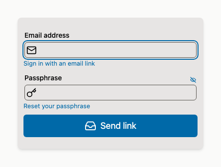
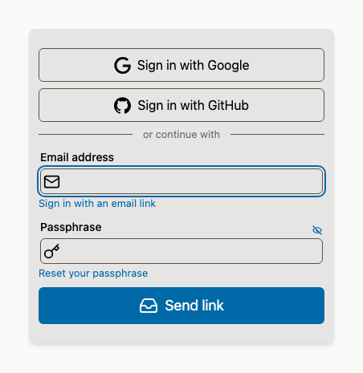
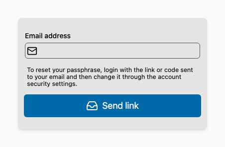
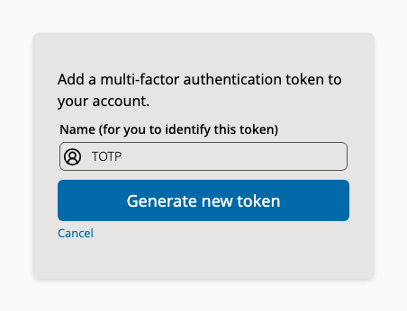

# Supabase Auth UI for Svelte

A comprehensive, customizable authentication UI component library for Supabase projects.
Built with Svelte 5 and TypeScript, this library provides a complete authentication flow 
with support for email/password, OAuth providers, multi-factor authentication (MFA), etc.
This library provides either a Svelte component or a custom element.

## Features

- Email and passphrase authentication
- Passwordless authentication (via email)
- Socal login with OAuth
- Multi-factor authentication
- Passphrase changes
- Account linking with social providers
- Layout options
- Flexible styling with CSS variables
- Account deletion support (requires Supabase code)
- Localization, including RTL support
- Passphrase strength checking per NIST guidelines

## Usage: Svelte

1.  Install with a package manager: `pnpm add -D svelte-supabase-auth @supabase/supabase-js svelte`
2.  Use in your Svelte components, e.g. at `src/routes/user/+page.svelte`:
   
    ```ts
    <script lang="ts">
      import type { Provider } from '@supabase/supabase-js';
      import type { PartialSupabaseAuthOptions } from 'svelte-supabase-auth';
      import { Auth } from 'svelte-supabase-auth';
      import { supabaseClient } from '$lib/supabaseClient';
      const providers:Provider[] = ['google', 'github'];

      // Import Supabase config directly if you wish (requires Vite configuration)
      import config from '../../../supabase/config.toml'

      const authOptions: PartialSupabaseAuthOptions = {
        auth: config?.auth, // Use auth config directly from Supabase
        deleteAccountFunction: 'delete_user_account', // RPC function name for account deletion
      }
      import { Auth } from 'svelte-supabase-auth'
      import { supabaseClient } from '$lib/supabase';
    </script>

    <Auth {supabaseClient} />
    ```

### Configuration Options

| Prop               | Type                                       | Default               | Description                                           |
| ------------------ | ------------------------------------------ | --------------------- | ----------------------------------------------------- |
| `supabaseClient`   | `SupabaseClient`                           | **Required**          | An initialized Supabase client instance               |
| `class`            | `string`                                   |                       | CSS classes for the container                         |
| `style`            | `string`                                   |                       | Inline styles for the container                       |
| `socialLayout`     | `'vertical' \| 'horizontal'`               | vertical              | Layout for social auth buttons                        |
| `socialButtonSize` | `'tiny' \| 'small' \| 'medium' \| 'large'` | medium                | Size of social auth buttons                           |
| `providers`        | `Provider[]`                               |                       | OAuth providers to display (requires Supabase config) |
| `initialView`      | `SignInView`                               | sign_in_with_password | Initial view to show                                  |
| `activeView`       | `ActiveView`                               | loading               | Current active view (bindable)                        |
| `authOptions`      | `PartialSupabaseAuthOptions`               | see [options.ts]      | Supabase Auth configuration options                   |
| `locale`           | `string`                                   | en                    | The two-letter language code for localization         |
| `texts`            | `Partial<AuthTexts>`                       |                       | Custom text overrides                                 |
| `t`                | `Function`                                 |                       | External i18n function                                |

### Snippets

| Snippet                       | Description                                            |
| ----------------------------- | ------------------------------------------------------ |
| `userInfo( user:User\|null )` | Custom user information display for authenticated view |

### Views

You can bind to the `activeView` prop to track which view is currently active:

| View                  | Description                              |
| --------------------- | ---------------------------------------- |
| sign_in               | Sign in view (Supabase "magic link")     |
| sign_in_with_password | Sign in with password view               |
| loading               | Initial loading state                    |
| no_auth_methods       | No authentication methods are configured |
| authenticated         | An authenticated user is available       |
| email_link_sent       | Email link has been sent                 |
| forgotten_password    | Password reset view                      |

### Localization

Svelte Supabase Auth is packaged with support for English, Spanish, French, Arabic, and simplified Chinese.

```svelte
<script>
  import { Auth } from 'svelte-supabase-auth'

  // Import additional languages
  import 'svelte-supabase-auth/i18n/languages/es'

  // Override English texts
  const texts = {
    signIn: 'Login',
    signUp: 'Create Account',
    emailLabel: 'Your Email'
  }
  
  // Set the locale as a reactive variable
  let locale = $state('en');

</script>

<Auth
  {supabaseClient}
  {texts}
  {locale}
/>
```

## Usage: Custom Element

You can install and use this with a package manager or even on an HTML web page,
as a custom element:

```html
<!DOCTYPE html>
<html>
<head>
  <script type="module">
    import 'svelte-supabase-auth/web-component'
  </script>
</head>
<body>
  <supabase-auth
    supabase-url="https://your-project.supabase.co"
    supabase-anon-key="your-anon-key"
    providers='["google", "github"]'
    social-layout="vertical"
    locale="en"
  ></supabase-auth>
</body>
</html>
```

### Web Component Attributes

| Attribute            | Type      | Description                                                                             |
| -------------------- | --------- | --------------------------------------------------------------------------------------- |
| `supabase-url`       | `string`  | **Required** - Your Supabase project URL                                                |
| `supabase-anon-key`  | `string`  | **Required** - Your Supabase anonymous key                                              |
| `providers`          | `string`  | JSON array of OAuth providers, e.g., `'["google", "github"]'`                           |
| `social-layout`      | `string`  | Layout for social buttons: `'vertical'` or `'horizontal'`                               |
| `social-button-size` | `string`  | Size of social buttons: `'tiny'`, `'small'`, `'medium'`, or `'large'`                   |
| `initial-view`       | `string`  | Initial view to show: `'sign_in'`, `'sign_in_with_password'`, or `'forgotten_password'` |
| `active-view`        | `string`  | **Reflected attribute** - Current active view (read-only, updates automatically)        |
| `locale`             | `string`  | Language locale, e.g., `'en'`, `'es'`, `'fr'`                                           |
| `auth-options`       | `string`  | JSON string of auth configuration options                                               |
| `texts`              | `string`  | JSON string of custom text overrides                                                    |
| `hide-user-info`     | `boolean` | Hide the default user info display (useful if you want to style the user info yourself) |

### Tracking Active View

The `active-view` attribute is automatically updated and can be observed to add custom HTML based on the current view.

```javascript
const authElement = document.querySelector('supabase-auth')

// Access via property
console.log(authElement.activeView) // e.g., 'authenticated', 'loading', etc.

// Observe attribute changes
const observer = new MutationObserver((mutations) => {
  mutations.forEach((mutation) => {
    if (mutation.type === 'attributes' && mutation.attributeName === 'active-view') {
      const activeView = authElement.getAttribute('active-view')
      if (activeView === 'authenticated') {
        // Add your custom profile form or other HTML
        document.getElementById('profile-form').style.display = 'block'
      } else {
        document.getElementById('profile-form').style.display = 'none'
      }
    }
  })
})
observer.observe(authElement, { attributes: true })
```

### Injecting a Supabase Client

You can inject an existing Supabase client instance instead of providing URL and key:

```javascript
import { createClient } from '@supabase/supabase-js'
import 'svelte-supabase-auth/web-component'

const supabaseClient = createClient('https://your-project.supabase.co', 'your-anon-key')
const authElement = document.querySelector('supabase-auth')
authElement.supabaseClient = supabaseClient
```

## Styling

The component uses the following css variables as design tokens:

```css
.sA {
  color-scheme: light dark;
  
  /* Colors - with automatic light/dark mode */
  --primary: light-dark(hsl(141, 71%, 48%), hsl(141, 71%, 55%));
  --primary-fg: white;
  --border: light-dark(#e5e7eb, #374151);
  --muted-fg: light-dark(#6b7280, #9ca3af);
  --danger: light-dark(hsl(358, 86%, 58%), hsl(358, 86%, 65%));
  --warning: light-dark(hsl(36, 100%, 44%), hsl(36, 100%, 55%));
  --success: light-dark(hsl(141, 71%, 48%), hsl(141, 71%, 55%));
  --link: currentColor; /* Inherits from parent */
  --ring: var(--primary); /* Focus ring color */
  
  /* Layout */
  --radius: 0.375rem;
  --input-padding: 5px 3px 5px 35px;
  --gap: 0.5em;
}
```

Altering those variables can be done in CSS or in the HTML itself:

```svelte
<Auth 
  {supabaseClient}
  style="
    --primary: purple;
    --radius: 1rem;
    --gap: 1rem;
  "
/>
```

## Project Structure

```
src/lib/
├── Auth.svelte              # Main Auth component
├── AuthCustomElement.svelte # Custom element wrapper for Auth component
├── components/              # Reusable components (molecules/organisms)
├── elements/                # Basic UI elements (atoms/molecules)
├── views/                   # Authentication views (organisms/templates)
├── i18n/                    # Internationalization
│   ├── index.ts             # Main i18n file
│   └── languages/           # Translation files
├── utils/                   # Utility functions
└── stores.svelte.ts         # Svelte stores
```

## Contributing

1. Fork the repository
2. Create a feature branch: `git checkout -b feature/new-feature`
3. Make your changes and add tests
4. Run the test suite: `pnpm test`
5. Commit your changes: `git commit -m 'Add new feature'`
6. Push to the branch: `git push origin feature/new-feature`
7. Submit a pull request

## Screenshots

### Screenshot: Login with Passphrase


### Screenshot: Login with Social or Email Link


### Screenshot: Reset Passphrase


### Screenshot: Multi-Factor Authentication


### Screenshot: Translated Interface


## Related

- [Supabase](https://supabase.com) - The open source Firebase alternative
- [Svelte](https://svelte.dev) - Cybernetically enhanced web apps
- [SvelteKit](https://kit.svelte.dev) - The fastest way to build svelte apps

## Support

For questions and support:
- [GitHub Issues](https://github.com/dnotes/svelte-supabase-auth/issues)
- [Supabase Docs](https://supabase.com/docs)
- [Svelte Community](https://svelte.dev/chat)

[options.ts]: https://github.com/dnotes/svelte-supabase-auth/blob/main/src/lib/options.ts
