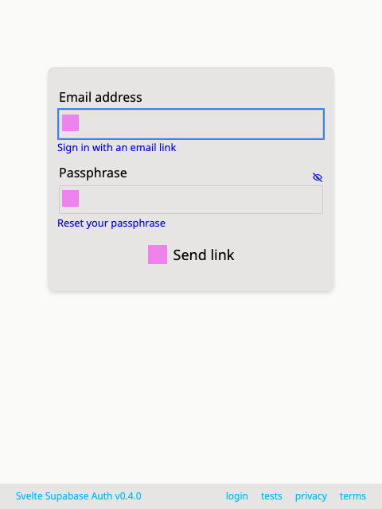
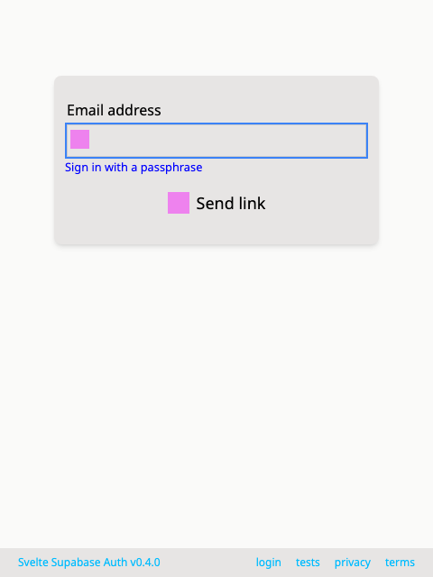

# Supabase Auth UI for Svelte

THIS README FILE WAS AI GENERATED BY CLAUDE 4 SONNET

A comprehensive, customizable authentication UI component library for Svelte applications using Supabase.
Built with Svelte 5 and TypeScript, this library provides a complete authentication flow with support for
email/password, OAuth providers, multi-factor authentication (MFA), and more.

## Features

### Complete Authentication Flow
- **Email/Password Authentication**: Sign up, sign in, and password reset
- **Magic Link Authentication**: Passwordless login via email links
- **Social OAuth Providers**: Support for Google, GitHub, and other OAuth providers
- **Multi-Factor Authentication (MFA)**: TOTP-based 2FA with QR codes
- **Account Management**: Profile updates, email changes, account deletion

### Highly Customizable
- **Flexible Styling**: CSS custom properties and customizable components
- **Layout Options**: Vertical/horizontal social button layouts
- **Size Variants**: Multiple button sizes (tiny, small, medium, large)
- **Custom Components**: Replace built-in components with your own

### Internationalization (i18n)
- **Built-in Languages**: English (default), Arabic, Spanish, French, Chinese
- **Custom Translations**: Add your own language translations
- **External i18n Support**: Integrate with existing i18n libraries
- **RTL Support**: Right-to-left language support

### Configurable Options
- **Supabase Config Integration**: Reads from `supabase/config.toml`
- **Password Policies**: Configurable length, complexity, breach checking
- **Email Settings**: OTP length, expiry, confirmation requirements
- **Security Features**: Double email confirmation, secure password changes

### Security Best Practices
- **NIST Guidelines**: Follows NIST 800-63b-4 authentication guidelines as much as possible
- **Password Strength**: Built-in password strength indicators
- **Breach Detection**: Integration with HaveIBeenPwned API

### Behavioral Testing Flows
- **Email signup/login**: Create account with password, email code, or email link
- **Multi-factor authentication**: Create, update, delete TOTP MFA factors
- **Password changes**: Change the password for the account
- **Password strength tests**: Disallow breached, repetitive, or context-specific passwords
- **Account deletion**: Delete an account completely (requires Supabase configuration)

## Installation

```bash
npm install svelte-supabase-auth
# or
pnpm add svelte-supabase-auth
# or
yarn add svelte-supabase-auth
```

### Peer Dependencies

```bash
npm install @supabase/supabase-js svelte
```

## Quick Start

Initialize the `Auth.svelte` component with a Supabase client, any providers that you want to support,
and any of the supported configuration. You can even use your Supabase `config.toml` file directly:

```svelte
/// src/routes/user/+page.svelte
<script>
  import 'svelte-supabase-auth/supabase-auth.css' // use the default styles for the library
  import type { Provider } from '@supabase/supabase-js'
  import type { PartialSupabaseAuthOptions } from 'svelte-supabase-auth'
  import { Auth } from 'svelte-supabase-auth'
  import { supabaseClient } from '$lib/supabaseClient'
  const providers:Provider[] = ['google', 'github']

  // Import Supabase config directly
  import config from '../supabase/config.toml'

  const authOptions: PartialSupabaseAuthOptions = {
    auth: config?.auth, // Use auth config directly from Supabase
    deleteAccountFunction: 'delete_user_account', // RPC function name for account deletion
  }
</script>

<Auth {supabaseClient} {authOptions} {providers} />
```

Note that using the `config.toml` file will probably require configuring Vite:

```ts
/// vite.config.ts
import { ViteToml } from 'vite-plugin-toml';
export default defineConfig({
	// @ts-ignore
	plugins: [
    // ...
		ViteToml(),
	],
	server: {
		fs: {
			allow: ['./supabase/config.toml'],
		},
	}
  // ...
})
```

The full set of configuration options are available as the PartialSupabaseAuthOptions type
from svelte-supabase-auth, or you can check out the full [options.ts] file.

### Internationalization

```svelte
<script>
  import { Auth } from 'svelte-supabase-auth'
  // Import additional languages
  import 'svelte-supabase-auth/i18n/languages/es'
  import 'svelte-supabase-auth/i18n/languages/fr'

  // Custom text overrides
  const customTexts = {
    signIn: 'Login',
    signUp: 'Create Account',
    emailLabel: 'Your Email'
  }
</script>

<Auth
  {supabaseClient}
  locale="es"
  texts={customTexts}
/>
```

### Custom Authenticated View

```svelte
<script>
  import { Auth } from 'svelte-supabase-auth'
</script>

<Auth {supabaseClient}>
  {#snippet signedInAs(user)}
    <div class="welcome-banner">
      <h2>Welcome back, {user?.email}!</h2>
      <p>Account created: {new Date(user?.created_at).toLocaleDateString()}</p>
    </div>
  {/snippet}

  {#snippet userInfo(user)}
    <div class="user-details">
      <p>Last sign in: {new Date(user?.last_sign_in_at).toLocaleDateString()}</p>
      <p>Email verified: {user?.email_confirmed_at ? 'Yes' : 'No'}</p>
    </div>
  {/snippet}
</Auth>
```

## Component Props

### Auth Component

| Prop               | Type                                       | Default                   | Description                     |
| ------------------ | ------------------------------------------ | ------------------------- | ------------------------------- |
| `supabaseClient`   | `SupabaseClient`                           | **Required**              | Supabase client instance        |
| `class`            | `string`                                   | `''`                      | CSS class for the container     |
| `style`            | `string`                                   | `''`                      | Inline styles for the container |
| `socialLayout`     | `'vertical' \| 'horizontal'`               | `'vertical'`              | Layout for social auth buttons  |
| `socialButtonSize` | `'tiny' \| 'small' \| 'medium' \| 'large'` | `'medium'`                | Size of social auth buttons     |
| `providers`        | `Provider[]`                               | `[]`                      | OAuth providers to display      |
| `initialView`      | `SignInView`                               | `'sign_in_with_password'` | Initial view to show            |
| `authOptions`      | `PartialSupabaseAuthOptions`               | see [options.ts]          | Auth configuration options      |
| `locale`           | `string`                                   | `'en'`                    | Language locale                 |
| `texts`            | `Partial<AuthTexts>`                       | `{}`                      | Custom text overrides           |
| `t`                | `Function`                                 | `undefined`               | External i18n function          |

### Snippets

| Snippet      | Parameters           | Description                         |
| ------------ | -------------------- | ----------------------------------- |
| `signedInAs` | `user: User \| null` | Custom signed-in user display       |
| `userInfo`   | `user: User \| null` | Additional user information display |

## Styling

### CSS Custom Properties

The component uses CSS variables for easy theming with automatic dark mode support:

```css
.sA {
  color-scheme: light dark;
  
  /* Colors - with automatic light/dark mode */
  --primary: light-dark(hsl(141, 71%, 48%), hsl(141, 71%, 55%));
  --primary-fg: white;
  --border: light-dark(#e5e7eb, #374151);
  --muted-fg: light-dark(#6b7280, #9ca3af);
  --danger: light-dark(hsl(358, 86%, 58%), hsl(358, 86%, 65%));
  --warning: light-dark(hsl(36, 100%, 44%), hsl(36, 100%, 55%));
  --success: light-dark(hsl(141, 71%, 48%), hsl(141, 71%, 55%));
  --link: currentColor; /* Inherits from parent */
  --ring: var(--primary); /* Focus ring color */
  
  /* Layout */
  --radius: 0.375rem;
  --input-padding: 5px 3px 5px 35px;
  --gap: 0.5em;
}
```

#### Customization Example

```svelte
<Auth 
  {supabaseClient}
  style="
    --primary: purple;
    --radius: 1rem;
    --gap: 1rem;
  "
/>
```

The `light-dark()` CSS function automatically adapts colors based on the user's system preference.
You can override any color with a simple value (hex, rgb, hsl, or named colors) and it will work in both light and dark modes.

If you want more control than this, you can choose not to import the library's CSS file,
which will avoid most of the styling related to colors, font sizes, etc., and will only have
styling related to layout and positioning.

## Project Structure

```
src/lib/
├── Auth.svelte              # Main Auth component
├── components/              # Reusable components
├── elements/                # Basic UI elements
├── views/                   # Authentication views
├── i18n/                    # Internationalization
│   ├── index.ts             # Main i18n file
│   └── languages/           # AI-generated translations
├── utils/                   # Utility functions
└── stores.svelte.ts         # Svelte stores
```

## Contributing

1. Fork the repository
2. Create a feature branch: `git checkout -b feature/new-feature`
3. Make your changes and add tests
4. Run the test suite: `pnpm test`
5. Commit your changes: `git commit -m 'Add new feature'`
6. Push to the branch: `git push origin feature/new-feature`
7. Submit a pull request

## Screenshots

### Default Login with Password


### Default Login with Magic Link


## Related

- [Supabase](https://supabase.com) - The open source Firebase alternative
- [Svelte](https://svelte.dev) - Cybernetically enhanced web apps
- [SvelteKit](https://kit.svelte.dev) - The fastest way to build svelte apps

## Support

For questions and support:
- [GitHub Issues](https://github.com/dnotes/svelte-supabase-auth/issues)
- [Supabase Community](https://supabase.com/docs)
- [Svelte Discord](https://svelte.dev/chat)

[options.ts]: https://github.com/dnotes/svelte-supabase-auth/blob/main/src/lib/options.ts


## Web Component

```
/**
 * Web Component Export for Supabase Auth
 *
 * This file provides a simple way to use the Supabase Auth component as a web component
 * in any HTML page or framework.
 */

import AuthCustomElement from './AuthCustomElement.svelte'

// The custom element is automatically registered when this module is imported
// The tag name is 'supabase-auth' as defined in the component

// Export the component for manual registration if needed
export { AuthCustomElement }

// Export types for TypeScript users
export type { AuthCustomElementProps } from './AuthCustomElement.svelte'

// Re-export Supabase types for convenience
export type { SupabaseClient, Provider, User } from '@supabase/supabase-js'
export type { AuthTexts } from './i18n'
export type { PartialSupabaseAuthOptions, SupabaseAuthOptions } from './options'
export type { SignInView } from './stores.svelte'

/**
 * Utility function to create a Supabase client
 * Useful for users who want to create their own client instance
 */
export { createClient } from '@supabase/supabase-js'

/**
 * Example usage:
 *
 * 1. Import this module in your application:
 *    import 'svelte-supabase-auth/web-component'
 *
 * 2. Use the custom element in your HTML:
 *    <supabase-auth
 *      supabase-url="https://your-project.supabase.co"
 *      supabase-anon-key="your-anon-key"
 *      providers='["google", "github"]'
 *      social-layout="vertical"
 *      locale="en"
 *    ></supabase-auth>
 *
 * 3. Access the user state via JavaScript:
 *    const authElement = document.querySelector('supabase-auth')
 *    console.log(authElement.user) // Current user or null
 */
```
